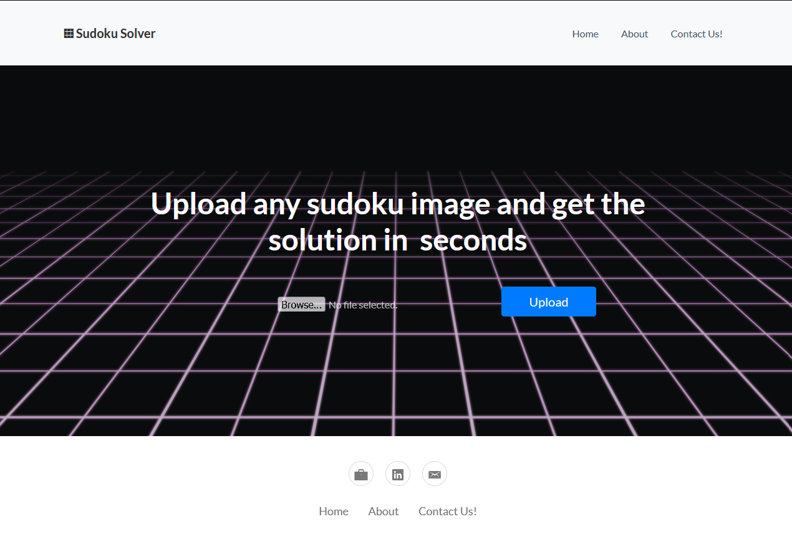
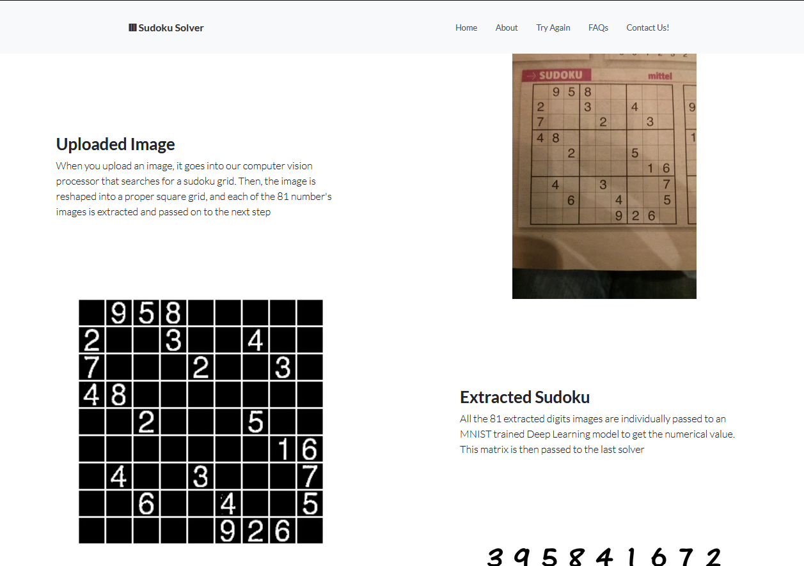
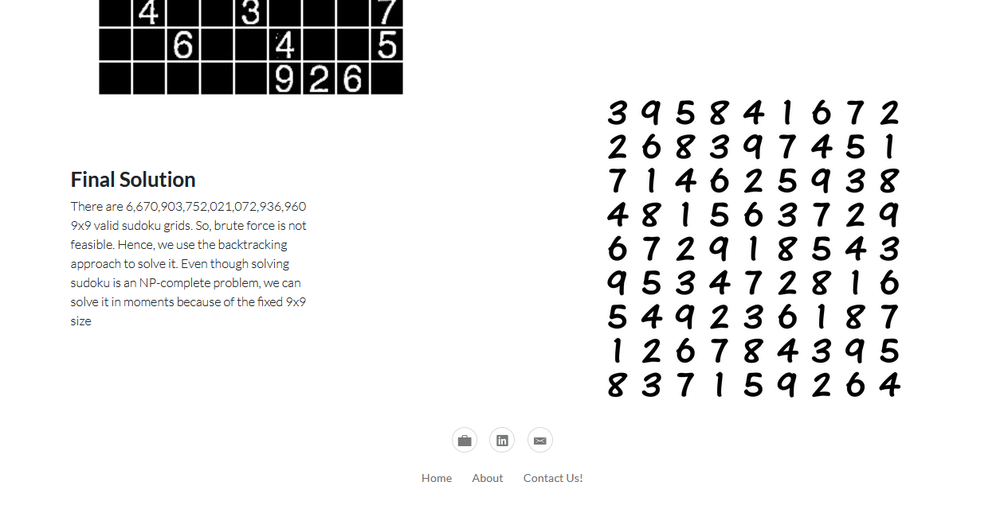

# Sudoku Solver
Sudoku solver is a dockerized django container available to pull from Dockerhub as `rudradesai200/mldeployed`. It can solve sudokus directly from the uploaded images. It utilizes Computer vision to identify the sudoku grid, deep learning to convert digit images to numbers and finally uses backtracking approach to solve the sudoku.

## Setup
  - First, download `docker` and verify you have properly installed it.
    - This link may help - [https://docs.docker.com/desktop/](Link)
  - Now, pull the mldeployed image using the following commmand (It may take some time depending on your internet connectivity)
    - `docker pull rudradesai200/mldeployed:latest`
  - The setup is complete, now you are ready to run the mldeployed image

## Usage
  - You can start the container by using the following command,
    - `docker run -it -p 8020:8020 rudradesai200/mldeployed:latest`
  - Once the image is run, you can open Sudoku Solver by opening the following url on any browser,
    - `http://localhost:8020` 

## Screenshots
1. Home Page for uploading images
    
2. Solution page 1
    
3. Solution page 2
    
## Extras
  - To open the admin console, you need to start the container with following flags
    - DJANGO_SUPERUSER_USERNAME
    - DJANGO_SUPERUSER_PASSWORD
    - DJANGO_SUPERUSER_EMAIL
  - For Ex,
    - `docker run -it -p 8020:8020 -e DJANGO_SUPERUSER_USERNAME=admin -e DJANGO_SUPERUSER_PASSWORD=password -e DJANGO_SUPERUSER_EMAIL=admin@example.com rudradesai200/cfviewer`
  - Now to access the admin console, go to
    - `http://localhost:8020/restricted`

